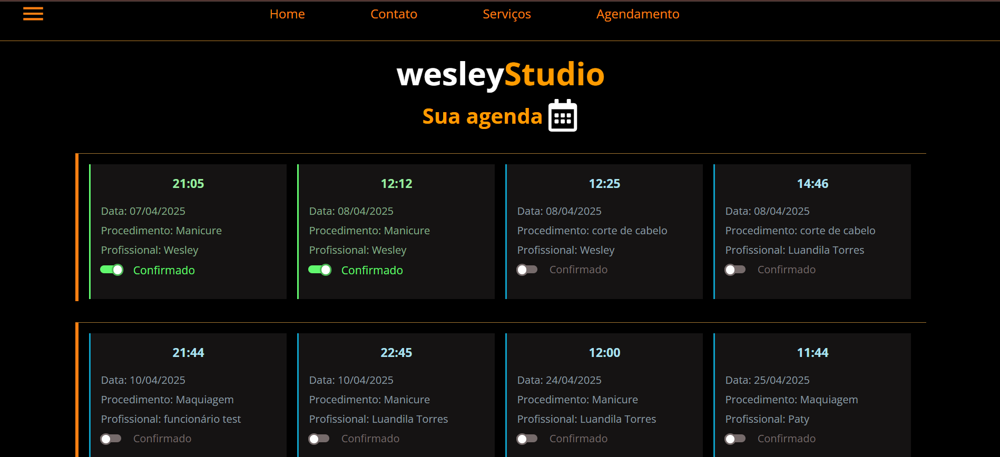

# PlatiformStudio

Uma plataforma moderna para gerenciamento e agendamento de sessões de estúdio, construída com Next.js, TypeScript e Supabase.

## 🚀 Funcionalidades

- **Autenticação de Usuários**: Sistema seguro de login e registro
- **Gerenciamento de Estúdios**: Crie e gerencie espaços de estúdio
- **Sistema de Agendamento**: Reserve e gerencie sessões de estúdio
- **Atualizações em Tempo Real**: Atualizações ao vivo para reservas e disponibilidade
- **Design Responsivo**: Funciona perfeitamente em desktop e dispositivos móveis

## 🛠️ Stack Tecnológica

- **Frontend**: Next.js 13+, TypeScript, Tailwind CSS
- **Backend**: Supabase
- **Autenticação**: Supabase Auth
- **Banco de Dados**: PostgreSQL (via Supabase)
- **Estilização**: Tailwind CSS, Shadcn UI
- **Gerenciamento de Estado**: React Query

## 📋 Pré-requisitos

Antes de começar, certifique-se de ter instalado:
- Node.js (v18 ou superior)
- npm ou yarn
- Git

## 🚀 Começando

1. Clone o repositório:

```bash
git clone https://github.com/yourusername/StudioPlatform.git
```

2. Instale as dependências:

```bash
npm install
# ou
yarn install
```

3. Configure as variáveis de ambiente:
Crie um arquivo `.env.local` na raiz do projeto e adicione suas credenciais do Supabase:

```env
NEXT_PUBLIC_SUPABASE_URL=sua_url_supabase
NEXT_PUBLIC_SUPABASE_ANON_KEY=sua_chave_anonima_supabase
```

4. Execute o servidor de desenvolvimento:

```bash
npm run dev
# ou
yarn dev
```

5. Abra [http://localhost:3000](http://localhost:3000) no seu navegador para ver a aplicação.

## 📁 Estrutura do Projeto

```
├── app/                # Diretório app do Next.js 13+
├── components/        # Componentes React reutilizáveis
├── lib/              # Funções utilitárias e helpers
├── public/           # Arquivos estáticos
└── types/            # Definições de tipos TypeScript
```

## 🔐 Autenticação

A plataforma utiliza Supabase Authentication para gerenciamento de usuários. Recursos incluem:
- Autenticação por email/senha
- Rotas protegidas
- Gerenciamento de perfil de usuário

## 📊 Esquema do Banco de Dados

A plataforma utiliza as seguintes tabelas principais:
- Usuários
- Estúdios
- Reservas
- Avaliações
- Pagamentos

## 🛡️ Segurança

- Políticas de Row Level Security (RLS) no Supabase
- Rotas de API protegidas
- Validação e sanitização de entrada
- Fluxo seguro de autenticação

## 🎨 Componentes de UI

A plataforma utiliza uma combinação de componentes personalizados e Shadcn UI para:
- Formulários e inputs
- Navegação
- Modais e diálogos
- Cards e layouts
- Estados de carregamento

## 📱 Design Responsivo

A plataforma é totalmente responsiva e funciona em:
- Computadores desktop
- Tablets
- Dispositivos móveis

## 🔄 Gerenciamento de Estado

- React Query para estado do servidor
- React Context para estado global da aplicação
- Estado local com useState e useReducer

## 🧪 Testes

Para executar os testes:

```bash
npm run test
# ou
yarn test
```

## 📦 Implantação

A aplicação pode ser implantada em várias plataformas:
- Vercel (recomendado)
- Netlify
- Servidor personalizado

## 🤝 Contribuindo

1. Faça um fork do repositório
2. Crie uma nova branch
3. Faça suas alterações
4. Envie um pull request

## 📄 Licença

Este projeto está licenciado sob a Licença MIT - veja o arquivo [LICENSE](LICENSE) para detalhes.

## 👥 Autores

- Alex Pro Gran - Trabalho inicial e manutenção

## 🙏 Agradecimentos

- Obrigado a todos os contribuidores
- Shadcn UI pela biblioteca de componentes
- Equipe Supabase pela infraestrutura de backend

## 📞 Suporte

Para suporte, por favor abra uma issue no repositório do GitHub ou entre em contato com os mantenedores.


Page home


# 
Cadastrando usuário


# 
Fomulário para agendamento


##
Agendamentos registrados



