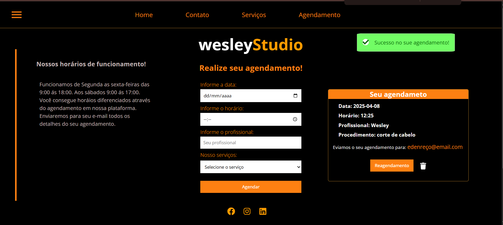

# PlatiformStudio

Plataforma para gerenciamento e agendamento de sessões de cuidados e estética. Construída com React e django.

## 🚀 Funcionalidades

- **Home**:


- **Autenticação de Usuários**: 


- **Agendameno com a equipe**



- **Centralização dos agendamentos e atualizados em tampo real**


## 🛠️ Stack Tecnológica

- **Frontend**: React, 
- **Backend**: Django,
- **Banco de Dados**: PostgreSQL (via Supabase)


## 📋 Pré-requisitos

Antes de começar, certifique-se de ter instalado:
- Node.js (v18 ou superior)
- Python

## 🚀 Começando

1. Clone o repositório:

```bash
git clone https://github.com/alexprogran/StudioPlatform.git
```

2. Instale as dependências:

```bash
npm install
# ou
yarn install
```

```bash
pip install -r requirements.txt

```


4. Execute o servidor de desenvolvimento:

```bash
npm run dev
# ou
yarn dev
```

```bash
pyton manage.py run server
```
5. Abra no seu navegador
- [http://localhost:5173] (React)
- [http://localhost:3000] (Django)  
    


## 📁 Estrutura do Projeto

```
├── README.md
├── backend
│   ├── base_studio
│   ├── db.sqlite3
│   ├── manage.py
│   ├── requirements.txt
│   ├── studio_backend
│   └── venv
└── my_project
    ├── README.md
    ├── db.json
    ├── eslint.config.js
    ├── index.html
    ├── node_modules
    ├── package-lock.json
    ├── package.json
    ├── public
    ├── src
    └── vite.config.js

```


## 📊 Esquema do Banco de Dados

A plataforma utiliza as seguintes tabelas principais:
- FormLogin
- SchedulingModel


## 📄 Licença

Este projeto está licenciado sob a Licença MIT - veja o arquivo [LICENSE](LICENSE) para detalhes.


